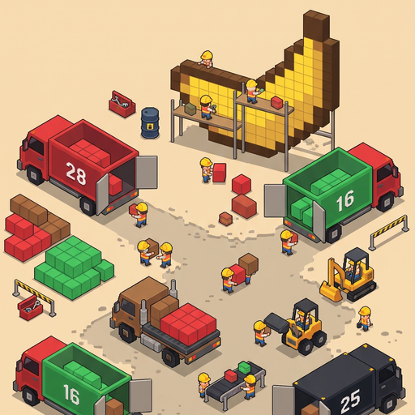
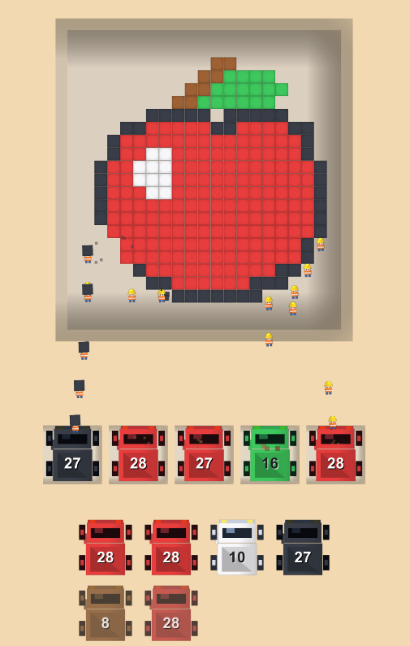
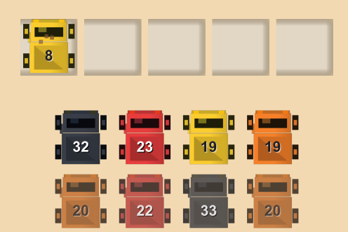
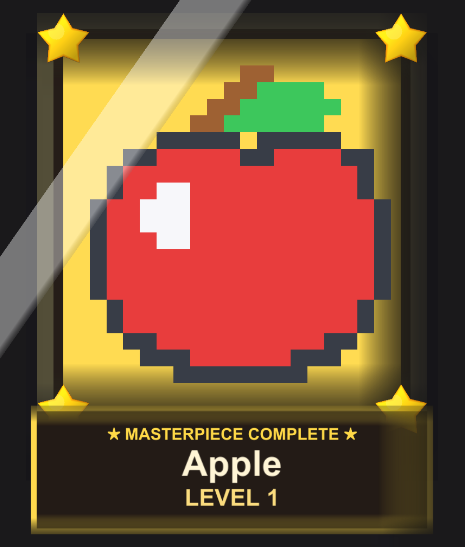
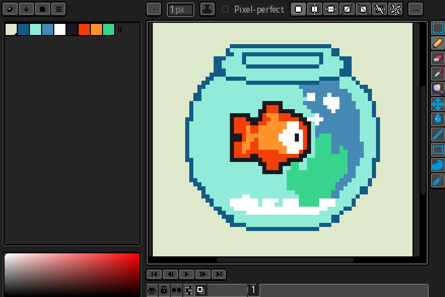
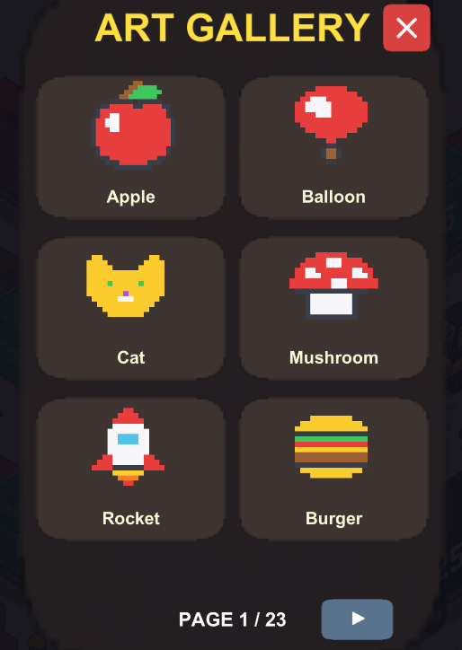

# 🏗️ Build Hunt

### 🔨 Demolish. Sort. Load.
#### A satisfying pixel art puzzle game for mobile.

---

> [!IMPORTANT]
> **This repository is a showcase page only.** The source code, assets and builds of Build Hunt are **proprietary and are not published here.**
> The game is a commercial-grade project and may be released as a paid title or licensed to a publisher.

---

## 🎮 About the Game

**Build Hunt** is a mobile puzzle game where you manage demolition logistics while a crew of workers breaks down giant pixel art structures and loads colored blocks into matching trucks.

Pick the right truck, send your workers to haul matching blocks, fill every truck to its capacity and clear the board to complete the level.

Easy to learn in seconds, with enough planning depth to keep every level interesting.

## 📸 Screenshots & Art Pipeline

<table>
  <thead>
    <tr>
      <th align="center">Core Gameplay</th>
      <th align="center">Truck Logistics</th>
      <th align="center">Masterpiece Victory</th>
    </tr>
  </thead>
  <tbody>
    <tr>
      <td align="center"></td>
      <td align="center"></td>
      <td align="center"></td>
    </tr>
    <tr>
      <th colspan="2" align="center">🎨 Handcrafted in LibreSprite (Pixel by Pixel)</th>
      <th align="center">🏛️ 23+ Page Art Gallery</th>
    </tr>
    <tr>
      <td colspan="2" align="center"></td>
      <td align="center"></td>
    </tr>
  </tbody>
</table>

## ✨ Core Features

- 🏛️ **23+ Page Art Gallery**: Over 130+ vibrant pixel art masterpieces (Apple, Rocket, Burger, Balloon, Cat, and many more) to unlock and demolish.
- 🎨 **100% Handcrafted Pixel Art**: Each sculpture and model is crafted pixel-by-pixel in LibreSprite for a clean, distinctive aesthetic.
- 🧱 **Pixel Art Levels**: Every level is a grid of colored blocks that together form a larger pixel art picture.
- 🚚 **Numbered Trucks**: Each truck targets a specific color and has a fixed capacity that must be filled before it departs.
- 👷 **Worker Logistics**: Workers automatically carry matching blocks from the board to the selected trucks.
- 🅿️ **Limited Truck Slots**: Only a handful of trucks can be active at once, so choosing the order matters.
- 🔒 **Special Truck Types**: Normal, locked, hidden, and linked trucks add layers of strategy as levels progress.
- 🎨 **12-Color Block Palette**: Optional per-level custom palettes for exact artist-controlled looks.
- 📳 **Juicy Feedback**: Particle effects, animated trucks, sound, and haptic feedback on key actions.
- 🧩 **Jam Detection**: The tray monitors for dead-end states so the player is never silently stuck.

## 🛠️ Technical Highlights

| Area | Details |
|---|---|
| **Engine** | Unity 6, C# |
| **Target Platforms** | iOS & Android (mobile-first, portrait) |
| **Architecture** | Event-driven design (`EventManager`) decoupling grid, trucks, workers and UI |
| **Performance** | High refresh-rate display support up to 120Hz / 120 FPS with fluid animations, zero-GC object pooling (`WorkerPoolManager`), and battery/thermal optimizations |

## 🧰 Built With

- **Unity 6** & **C#**
- **LibreSprite** (100% Handcrafted Pixel Art)

## 📅 Status

🚧 **In active development.** Core loop, level pipeline and mobile build are working. Content, polish and monetization design are in progress.

## 📬 Contact

Interested in the game, a publishing deal or a collaboration?

- 📧 **Email:** [emir.bekar@bilgiedu.net](mailto:emir.bekar@bilgiedu.net)
- ▶️ **YouTube:** [@emiukob](https://www.youtube.com/@emiukob)
- 🏝️ **Portfolio:** [emiukob.github.io](https://emiukob.github.io)

## ⚖️ Copyright & License

**© 2026 Emir Bekar. All Rights Reserved.**

Build Hunt, its source code, art, audio, level designs, name and logo are proprietary.
No part of this project may be copied, redistributed, modified, sublicensed or used commercially without prior written permission from the author.
This README and its screenshots are provided for portfolio and promotional purposes only.
